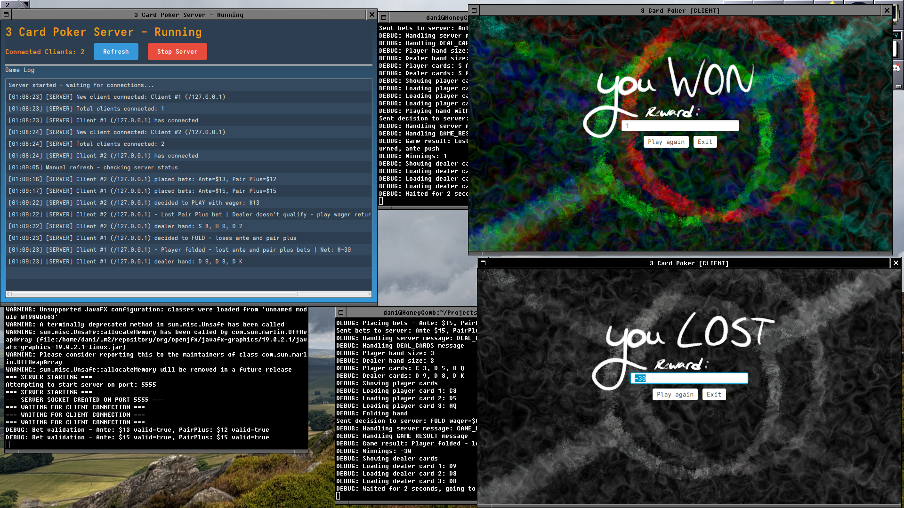

# Card-Poker
A multiplayer card poker game written in Java, using the JavaFX library

## Overview
On November 23, 2025, in a collaboration with user **Tundra96662**, we made a card poker program as part of a project.
Split between two seperate programs, you are able to play a game of card poker with others, within a locally-hosted server.

This repository serves as a house for both the server and client repositories that Tunda and I made, respectively.

## Links to original repositories:
CLIENT: https://github.com/Bullsquidz/Card-Poker-Client

SERVER: https://github.com/Tundra96662/JavaFX_MavenTemplate_Server

## Requirements
Any up-to-date version of Java and Maven (April 17, 2026).

## Compiling
For both applications, when in a directory with a POM file, type ``mvn compile`` and then ``mvn exec:java``.

**I had to change the POM file for the client to run correctly as of April 2026. Fingers crossed I dont need to do that again!**

## How to host
- Input any 4-digit number for the ``Server Port`` before pressing ``Start Server``.
- You can then close the server whenever you want. *If the screen starts to bug out, try pressing the ``Refresh`` Button!*

## How to play
- Input the same 4-digit port number for the ``Server Port``.
- For a locally hosted game, insert ``127.0.0.1`` within the ``Server IP`` box. Then you're ready to start!
- Input a number between 5 - 15 within the ``Ante`` and ``Pair Plus`` boxes before pressing ``Deal``.
- 3 cards are then shown to you, then you can either ``play`` or ``fold`` your those cards.
- Then lastly, you hope for the best that you win!

**You can refresh your score and change the look of your UI through the menu on the top left.**

## Screenshots
   
